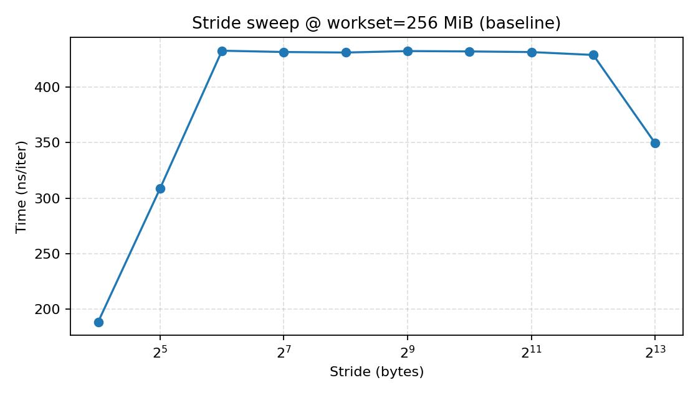
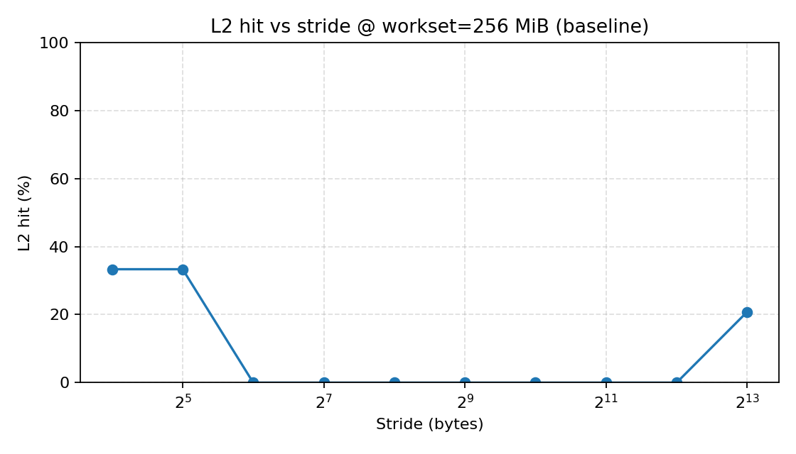
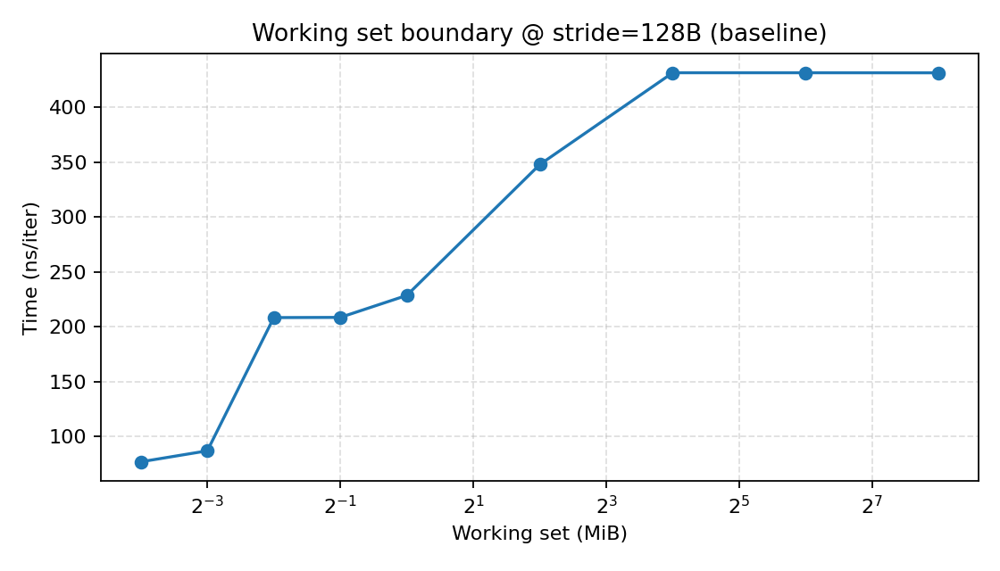
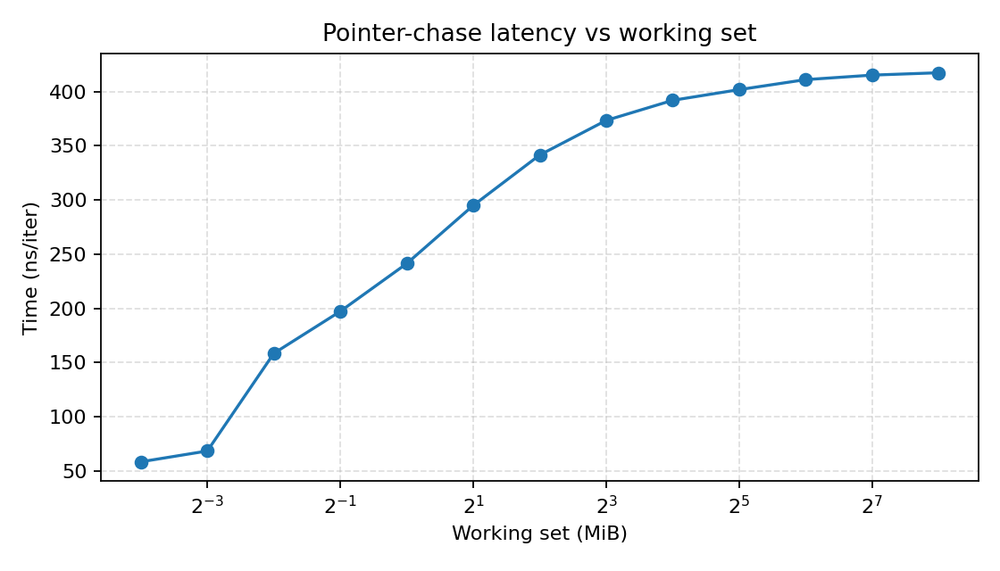
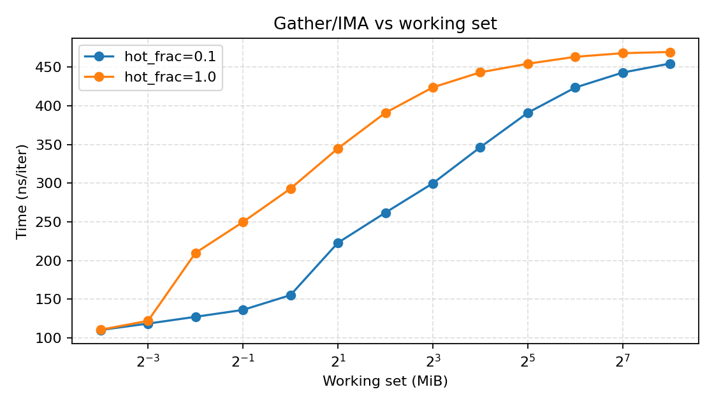
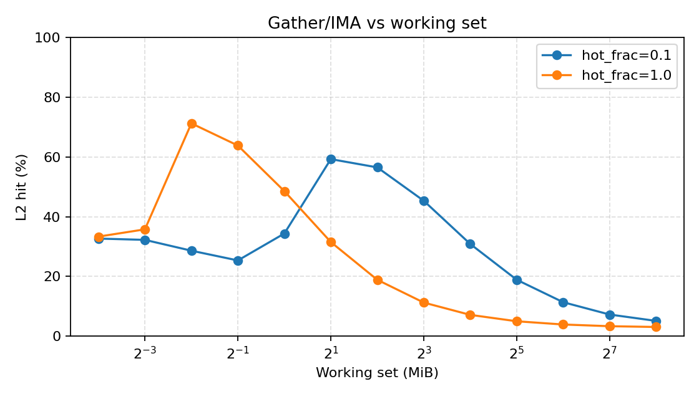
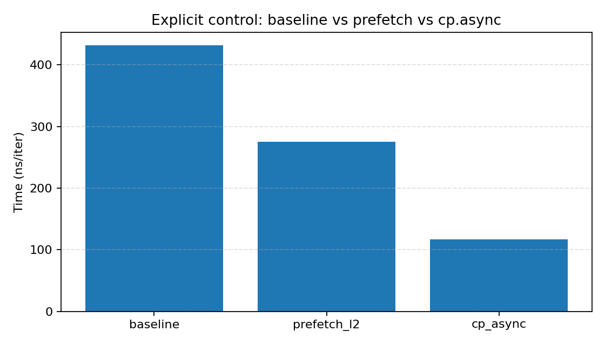

# Prefetch microbench results (2026-02-05)

本次结果目录：`cuTest/prefetch/out/20260205_171554/`

## 环境信息

- GPU：NVIDIA A100 80GB PCIe（SM80 / CC 8.0）
- Driver：535.216.03；CUDA：12.6
- 编译：`nvcc -O3 -std=c++17 -lineinfo -arch=sm_80`（见 `cuTest/prefetch/Makefile`）
- Profiler：Nsight Compute CLI `ncu` 2024.3；Nsight Systems `nsys` 2024.4
- 运行约束：单 block（32 threads=1 warp），仅 lane0 执行；每次测量前用 128MiB buffer flush L2
- 原始环境输出：`cuTest/prefetch/out/20260205_171554/env.json`

## 实验原理（为什么能推断“自动 prefetch”）

这份实验的目标是识别“**更像硬件自动预取/自动搬运**”的现象签名，而不是直接证明“某个具体 prefetcher 的实现细节”。思路是用 **单 warp 近似测延迟** 的方式，把“是否提前把数据搬到更近的层级（L2/L1/shared）”转化为可观测的 **延迟下降 + 命中率变化**。

### 1) 为什么用“单 SM / 单 warp”

GPU 上常见的“看不出延迟”主要来自 **延迟隐藏**：同一 SM 上有很多 warp 时，一个 warp 在等内存，SM 可以切到别的 warp 执行，从而把等待时间摊掉。为了尽量看到“单次 load 的服务时间”，这里把并发压到极低：

- `grid=(1,1,1)`, `block=(32,1,1)`：只有一个 block，必然只落在一个 SM 上。
- 只有 lane0 真正执行访存循环：其它 lane 立即 `return`，避免一个 warp 内 32 个线程同时发请求。
- `#pragma unroll 1`：避免编译器展开循环导致“一个迭代里发出多条 load”，从而产生 ILP/MLP（这会伪装成“更快”）。

在这种设置下，时间 `time_ns_per_iter` 可以近似理解为：

> 每次迭代发出 1 次（或固定次数）访存请求后，warp 在 long-scoreboard 上等待该请求完成的平均时间。

这也是为什么表里 `stall_long_scoreboard_pct` 会在 DRAM 主导时很高（本次多为 80%~90%）。

### 2) 为什么“无复用”很关键

要把“预取”与“复用（缓存命中）”区分开，关键是构造一种访问序列，使得 **(a) 工作集远大于 cache**，且 **(b) 在本次测量窗口内几乎不重复访问同一地址**。这样如果还能看到明显的 L2 hit，那么更合理的解释就是：在 demand load 到来之前，硬件已经把后续地址的数据搬进了 L2（即某种自动预取/自动搬运机制）。

本实验做了几层约束来尽量保证“无复用”：

- Working set 扫到 256MiB（远大于 A100 的单卡 L2 容量量级）。
- 每个 repeat 前用 128MiB buffer 读一遍来 **冲刷 L2**（减少“上一次 run 留下来的热数据”）。
- **避免短周期环**：当工作集元素数 `N` 为偶数时，stride 访问 `idx=(idx+stride) mod N` 可能因为 `gcd(N,stride)>1` 在很短周期内回绕，产生“假复用”。这里把 stride 基准内部的 `N` 变成奇数（`N-1`），使得对 2 的幂 stride 有更长周期（多数情况下 `gcd=1`）。
- 因为 stride=8192B 时地址间隔远大于 cache line，所以它天然排除了“同一个 cache line 内的空间复用”。（对 stride=16B/32B 这种小步长，看到命中是正常的空间局部性，不用于判断 prefetch。）

### 3) 用什么“签名”判断可能存在自动预取

在“单 warp、无复用”的前提下，**如果不存在自动预取**，对大工作集 & 大 stride 的访问应该表现为：

- `time_ns_per_iter` 接近一个稳定的平台（DRAM 服务时间 + 少量指令开销）
- `L2 hit(%)` 接近 0

**如果某种自动预取/自动搬运生效**，则会出现：

- `L2 hit(%)` 明显上升（尽管没有复用、工作集很大）
- `time_ns_per_iter` 同步下降（因为一部分迭代的 demand load 变成了 L2 hit）
- `dram__sectors_read.sum` 可能变化：预取既可能带来额外 DRAM 流量（多读了一些），也可能让 DRAM 读的“形态/合并方式”改变；因此它不是最核心判据，更多作为辅证。

### 4) 为什么需要反例/上界对照

- **反例（pointer-chase）**：地址依赖（下一次地址由上一次加载结果决定）会让通用 stride/stream 预取器难以工作；如果 pointer-chase 也出现类似 “L2 hit 上升 + 延迟明显下降”，那更可能是测量链路或复用没控制好。
- **上界对照（显式 prefetch / cp.async）**：证明“只要数据真的提前进 L2/shared，链路能测出来”。否则就算硬件有预取，也可能被测量噪声淹没。

## 例子：如何从不同结果推导结论

以 **working set = 256MiB** 的 baseline stride 为例（来自 `exp1_stride.csv`）：

| 配置 | 现象（节选） | 推导 |
|---|---|---|
| stride=128B | `time_ns_per_iter≈431.48`，`L2 hit≈0%`，`stall_long_scoreboard≈87.7%` | 典型 DRAM 平台：几乎每次 demand load 都要等 DRAM 返回，说明没有“提前到 L2”的效果。 |
| stride=8192B | `time_ns_per_iter≈349.34`，`L2 hit≈20.81%`，`stall_long_scoreboard≈84.6%` | 地址间隔很大、且已尽量排除短周期复用；在这种情况下仍出现约 20% 的 L2 hit，并伴随显著的延迟下降，更符合“硬件提前把一部分后续地址搬进 L2”的解释（即某种自动预取/自动搬运被触发）。一个粗略估算：若把 128B 的 431ns/iter 当作 DRAM 延迟平台，用 `Tavg ≈ h·TL2 + (1-h)·Tdram` 反推 `TL2`，可得 `TL2≈36.8ns`（数量级合理）。 |
| pointer-chase @256MiB（反例） | `time_ns_per_iter≈417.49`，`L2 hit≈0.27%`（见 `exp2_pointer_chase.csv`） | 地址依赖下 L2 hit 仍接近 0，延迟接近 DRAM 平台；这支持“stride=8192B 的 L2 hit 上升不是普遍的测量假象，而与规律访问模式相关”。 |

同时注意：对 stride=16B 这种小 stride，`L1 hit≈50%` 且延迟很低（≈188ns/iter）主要来自**空间局部性**（一次 line/sector 填充被多次使用），它并不能说明存在“跨 line 的自动预取器”；因此我们判断“自动 prefetch”主要看大 stride（远大于 cache line）区域的拐点/命中变化。

## 实验 1：Stream/Stride（Baseline）

- Kernel：`stride_baseline_kernel`
- 说明：为避免“power-of-two 工作集 + power-of-two stride”导致短周期循环（提前回绕→假复用），该基准内部对 stride 环使用奇数 modulus（`N` 为偶数时用 `N-1`）。
- 参数 sweep：
  - stride(bytes)：16, 32, 64, 128, 256, 512, 1024, 2048, 4096, 8192
  - working set(bytes)：64KiB, 128KiB, 256KiB, 512KiB, 1MiB, 4MiB, 16MiB, 64MiB, 256MiB
  - blocks/threads：1×32（单 warp）
- 数据表：`cuTest/prefetch/out/20260205_171554/exp1_stride.csv`

图片：

解释模板：在 256MiB 工作集下，大部分 stride（64B~4096B）呈现接近常数的 ~431ns/iter，符合“每次 load 主要落到 DRAM”的特征；当 stride=8192B 时出现明显下降（~349ns/iter）。在“单 warp + 尽量无复用”的设定下，这类拐点通常意味着：有一部分 demand load 不再等 DRAM（更可能 hit 在更近层级，例如 L2）。

解释模板：同一组配置下，L2 hit(%) 在 stride=64B~4096B 近似为 0（表示首次触达基本都从 DRAM 来）；但 stride=8192B 时 L2 hit(%) ≈ 20.8%，与延迟下降同步出现。由于 stride=8192B 远大于 cache line，且本实验已尽量排除短周期复用，这种“无复用前提下 L2 hit 上升”的组合更像是某种自动预取/自动搬运在起作用。`dram__sectors_read.sum` 可作为辅证（预取可能改变 DRAM 读流量形态），但不是唯一判据。

解释模板：固定 stride=128B 时，随着工作集增大，时间(ns/iter) 逐步逼近稳定的 DRAM 延迟平台（本次约 ~431ns/iter），并伴随 L1/L2 命中率下降。该图用于验证测量链路能够反映 L1/L2/DRAM 边界趋势（虽本实验选择 single-warp 且按“首次触达”口径测量，因而小工作集也可能表现为 miss 主导）。

## 实验 2：Pointer-chase（反例）

- Kernel：`pointer_chase_kernel`（LCG permutation 链式追逐，地址依赖，难以通用预取）
- sweep：working set 64KiB ~ 256MiB（见 csv）
- 数据表：`cuTest/prefetch/out/20260205_171554/exp2_pointer_chase.csv`

解释模板：随着工作集增大，延迟趋向 ~417ns/iter，且 L2 hit(%) 接近 0（256MiB 时约 0.27%），符合“不可预取 + DRAM 主导”的预期。该反例用于证明：观测到的 L2 hit 上升并非来自测量链路误差，而与访问模式相关。

## 实验 3：Gather / IMA

- Kernel：`gather_ima_kernel`（先读 `indices[i]`，再读 `data[indices[i]]`）
- sweep：working set 64KiB ~ 256MiB；hotset：`hot_frac ∈ {1.0, 0.1}`, `hot_prob=0.9`
- 数据表：`cuTest/prefetch/out/20260205_171554/exp3_gather.csv`

解释模板：Gather/IMA 的平均延迟随工作集增大而上升，并稳定在 ~450–470ns/iter 量级；引入 hotset（hot_frac=0.1）可带来小幅改善。该基准更贴近真实“间接访存”痛点：数据访问不可预测时，即使单 warp 也更易被 DRAM/长记分牌 stall 主导。

解释模板：L2 hit(%) 整体偏低且随工作集增大进一步下降；hotset 配置会让 L2 hit 略有提升。结合延迟曲线可用于判断：瓶颈主要来自 cache miss 与长记分牌等待。

## 实验 4：显式对照（上界）

- 对照 A：`prefetch.global.L2`（Kernel：`stride_prefetch_l2_kernel`）
- 对照 B：`cp.async` 到 shared（Kernel：`stride_cp_async_kernel`）
- 配置：working set=256MiB，stride=128B
- 数据表：`cuTest/prefetch/out/20260205_171554/exp4_explicit.csv`

解释模板：同一配置下，baseline ~431.5ns/iter；显式 `prefetch.global.L2` 可降至 ~275.2ns/iter（同时 L2 hit(%)≈33.4，DRAM sectors 增加，符合“prefetch 产生额外读流量”的预期）；`cp.async` 进一步降至 ~117.0ns/iter，并显著降低 long-scoreboard stall。该对照证明：本实验链路对“显式预取/显式异步搬运”是敏感的。

## 原始数据与 profiler 输出

- 原始 CSV：`exp1_stride.csv` / `exp2_pointer_chase.csv` / `exp3_gather.csv` / `exp4_explicit.csv`
- ncu 原始输出：`cuTest/prefetch/out/20260205_171554/ncu/`
