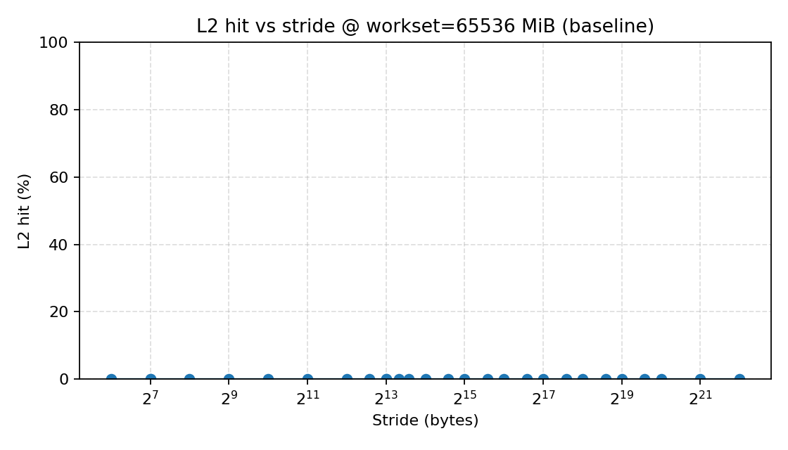
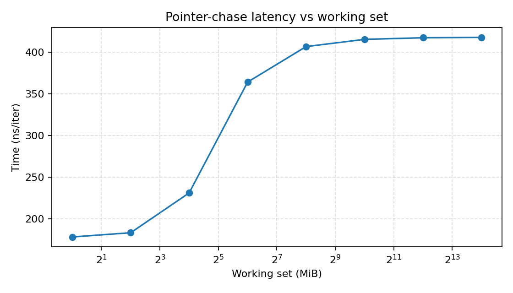
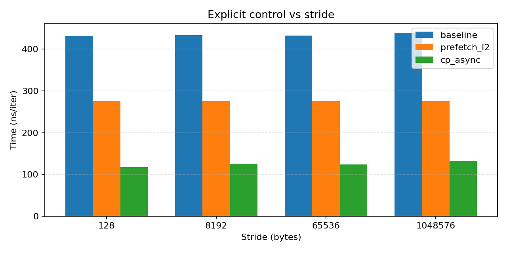

# Prefetch microbench results (rerun, 2026-02-05)

本次结果目录：`cuTest/prefetch/out/20260205_212216/`

## 环境信息

- GPU：NVIDIA A100 80GB PCIe（SM80 / CC 8.0）
- Driver：535.216.03；CUDA：12.6
- 编译：`nvcc -O3 -std=c++17 -lineinfo -arch=sm_80`（见 `cuTest/prefetch/Makefile`）
- Profiler：Nsight Compute CLI `ncu` 2024.3；Nsight Systems `nsys` 2024.4
- 运行约束：单 block（32 threads=1 warp），仅 lane0 执行；每次测量前用 128MiB buffer flush L2
- 本轮关键容量：`workset_large = 64 GiB`（约 65,536 MiB）
- 本轮关键时长：默认 `iters = 1,000,000`；超大 stride 自动降低 iters 以避免地址回绕

原始环境输出：`cuTest/prefetch/out/20260205_212216/env.json`

## 测试代码逻辑（含示意图）

代码分为三层：

1. 宿主机脚本：`cuTest/prefetch/run_fa.sh`
2. 扫描与采集：`cuTest/prefetch/scripts/run_all.py`
3. 微基准内核：`cuTest/prefetch/prefetch_bench.cu`

执行流程图：

```text
[host] run_fa.sh
   |
   +--> docker cp 源码到 fa:/tmp/...
   +--> docker exec fa: make -j
   +--> docker exec fa: python3 scripts/run_all.py
             |
             +--> 对每个配置:
             |      1) 运行 prefetch_bench --format json (拿 timing)
             |      2) 运行 ncu counters (拿 L1/L2/DRAM/stall)
             |      3) 合并成一行 CSV
             |
             +--> 画图 (PNG): stride / p-chasing / gather / explicit
   |
   +--> docker cp 结果回宿主机 out/<timestamp>/
```

核心访存逻辑图（baseline stride）：

```text
idx = 0
repeat t times:
  idx = idx + stride
  if idx >= n:
    idx = idx - n
  v = data[idx]      // lane0 读取
```

本轮对自动预取判断最关键的控制是 `no-wrap`：

- 在 Exp1a 和 Exp4 中把 `iters` 限制为“不会进入 `idx = idx - n`”
- 目的：避免地址回绕导致额外 cache-line 复用，误判为 prefetch
- 对应实现：`cuTest/prefetch/scripts/run_all.py` 中的 `clamp_iters_no_mod_wrap()`

核心访存逻辑图（p-chasing）：

```text
p = 0
repeat t times:
  p = next[p]        // 下一次地址依赖本次结果
  acc ^= p
```

这个链式依赖会抑制通用 stride/stream 预取器，是自动预取检测里的反例。

## 实验 1：Stream/Stride（Baseline, no-wrap）

数据表：`cuTest/prefetch/out/20260205_212216/exp1_stride.csv`

结论：在 `workset=64 GiB` 下，stride 从 `64 B` 到 `4 MB`，baseline 的 `L2 hit` 全部为 `0.00%`，延迟保持在 DRAM 平台（约 `428~454 ns/iter`），没有看到自动预取拐点。

节选（单位已转成可读形式）：

| workset | stride | iters | time (ns/iter) | L2 hit (%) | L1 hit (%) |
|---:|---:|---:|---:|---:|---:|
| 64 GiB | 128 B | 1,000,000 | 431.496 | 0.00 | 0.00 |
| 64 GiB | 8 KB | 1,000,000 | 433.543 | 0.00 | 0.00 |
| 64 GiB | 64 KB | 1,000,000 | 432.192 | 0.00 | 0.00 |
| 64 GiB | 256 KB | 262,143 | 435.535 | 0.00 | 0.00 |
| 64 GiB | 1 MB | 65,535 | 439.325 | 0.00 | 0.00 |




## 实验 2：Pointer-chase（反例）

数据表：`cuTest/prefetch/out/20260205_212216/exp2_pointer_chase.csv`

节选（单位已转成可读形式）：

| workset | time (ns/iter) | L2 hit (%) | L1 hit (%) |
|---:|---:|---:|---:|
| 1 MB | 178.160 | 87.69 | 4.73 |
| 4 MB | 183.220 | 87.57 | 1.07 |
| 16 MB | 231.040 | 58.80 | 0.24 |
| 64 MB | 364.206 | 8.32 | 0.06 |
| 256 MB | 406.866 | 1.70 | 0.01 |
| 1 GB | 415.545 | 0.40 | 0.00 |
| 4 GB | 417.466 | 0.10 | 0.00 |
| 16 GB | 417.987 | 0.02 | 0.00 |



说明：大工作集下 p-chasing 收敛到约 `418 ns/iter` 且 `L2 hit -> 0`，符合“地址依赖 + DRAM 主导”。

## 实验 4：显式对照

数据表：`cuTest/prefetch/out/20260205_212216/exp4_explicit.csv`

| workset | stride | variant | time (ns/iter) | L2 hit (%) | 备注 |
|---:|---:|---|---:|---:|---|
| 64 GiB | 128 B | baseline | 431.469 | 0.00 | 基线 |
| 64 GiB | 128 B | prefetch_l2 | 275.151 | 33.34 | 显式 `prefetch.global.L2` |
| 64 GiB | 128 B | cp_async | 117.021 | 0.00 | 显式 async 搬运到 shared |
| 64 GiB | 8 KB | baseline | 433.533 | 0.00 | 基线 |
| 64 GiB | 8 KB | prefetch_l2 | 275.360 | 33.33 | 显式 `prefetch.global.L2` |
| 64 GiB | 8 KB | cp_async | 125.516 | 0.00 | 显式 async 搬运到 shared |



说明：显式 prefetch/async 搬运能稳定降低延迟，证明测量链路是敏感的；因此 baseline 无拐点更可信。

## 结论（本轮仅回答“是否存在自动预取”）

- 在 `64 GiB` 大工作集 + 长迭代 + `no-wrap` 控制下，baseline stride 没有出现自动预取签名（`L2 hit` 抬升 + 延迟同步下降）。
- p-chasing（反例）在大工作集下表现为 `L2 hit≈0` 且 DRAM 延迟平台，符合预期。
- 显式对照显著生效，排除了“链路不敏感导致看不到”的解释。
- 当前证据更支持：在本探针条件下，未观察到可归因为通用硬件自动 prefetch 的现象。
